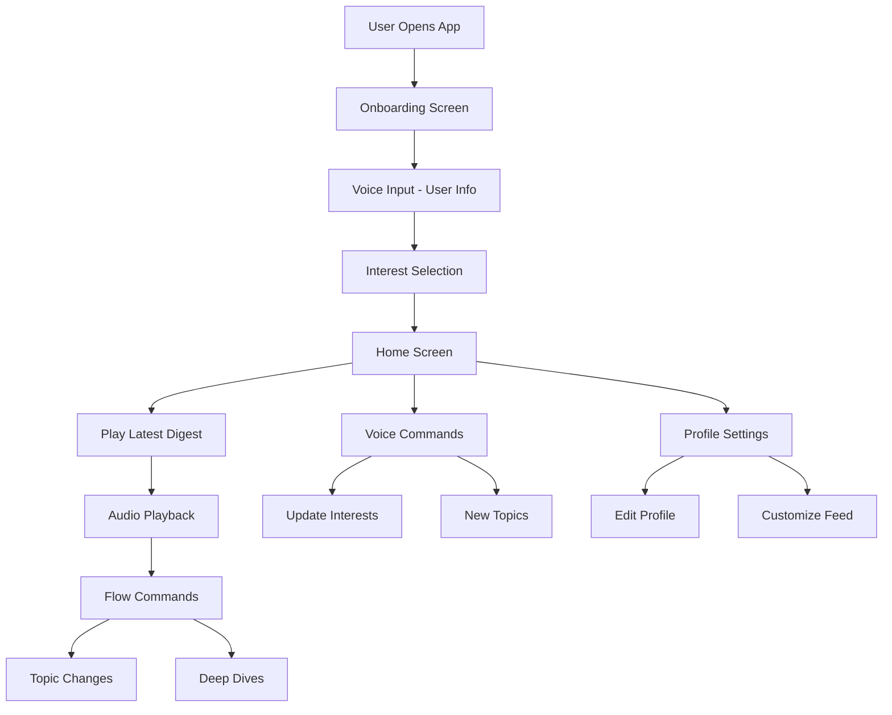
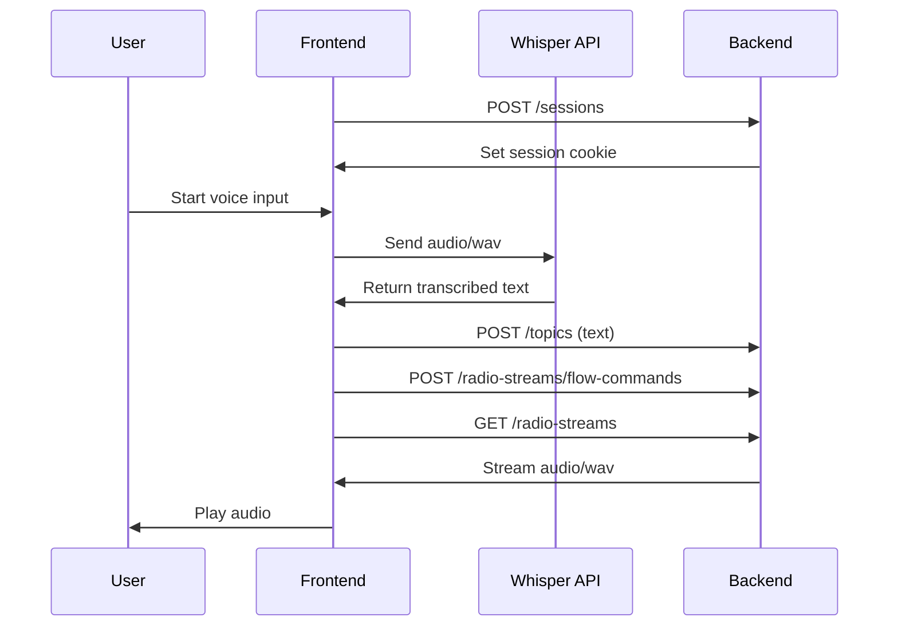
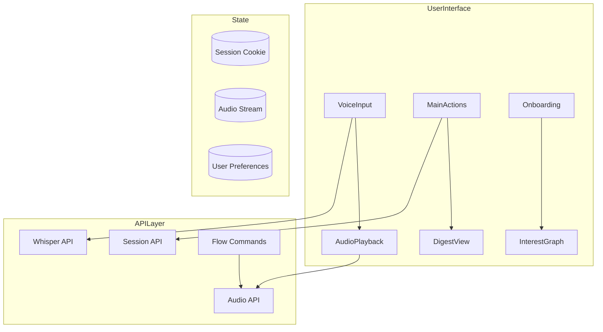
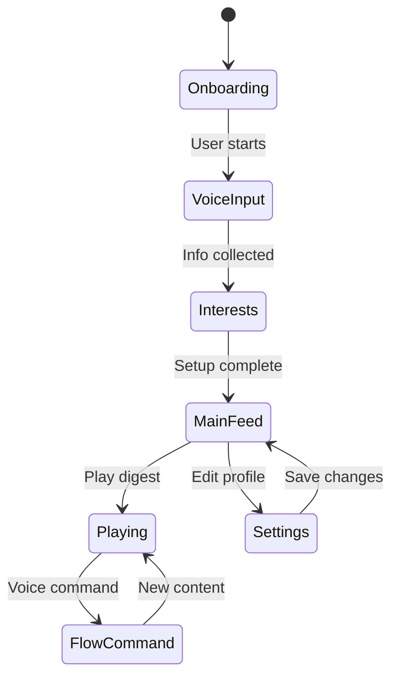

# Loopcast Frontend

## Overview
Loopcast is an AI-powered radio app that creates personalized audio digests based on user interests. The frontend is built with Next.js 14, using modern React patterns and shadcn/ui components.

## Project Structure
```
loopcast-frontend-1/
├── app/                      # Next.js 14 App Router directory
│   ├── components/          # React components
│   │   ├── AudioPlayback.tsx    # Audio streaming component
│   │   ├── AudioPlayer.tsx      # Audio controls UI
│   │   ├── BottomNav.tsx        # Navigation bar
│   │   ├── Customization.tsx    # User preferences
│   │   ├── DigestPreparation.tsx # Loading states
│   │   ├── DigestView.tsx       # Main digest display
│   │   ├── EditInterest.tsx     # Interest editing
│   │   ├── FullScreenEdit.tsx   # Full screen editor
│   │   ├── FullScreenInterest.tsx # Interest view
│   │   ├── InterestGraph.tsx    # Interest visualization
│   │   ├── InterestNode.tsx     # Graph node component
│   │   ├── KnowledgeGraph.tsx   # Knowledge display
│   │   ├── LocationInput.tsx    # Location selector
│   │   ├── MainActions.tsx      # Primary actions
│   │   ├── NameInput.tsx        # Name input field
│   │   ├── OccupationInput.tsx  # Job input field
│   │   ├── Onboarding.tsx       # User onboarding
│   │   ├── ProcessingPage.tsx   # Loading states
│   │   ├── ProfileSettings.tsx  # User settings
│   │   ├── ThreadsList.tsx      # Content threads
│   │   ├── VoiceInput.tsx       # Voice commands
│   │   └── VoiceInputScreen.tsx # Voice UI
│   ├── lib/                 # Shared utilities
│   │   ├── api/            # API integration
│   │   │   ├── session.ts      # Session management
│   │   │   ├── audio.ts        # Audio streaming
│   │   │   ├── whisper.ts      # Voice transcription
│   │   │   └── flow-commands.ts # Flow control
│   │   └── websocket/      # Real-time comms
│   ├── globals.css         # Global styles
│   ├── layout.tsx          # Root layout
│   └── page.tsx            # Root page
├── components/             # Shared components
│   ├── theme-provider.tsx  # Theme context
│   └── ui/                # UI components
│       └── [shadcn components]  # Design system
├── docs/                   # Documentation
│   └── specs/             # Technical specs
├── hooks/                 # Custom React hooks
├── lib/                   # Utility functions
├── public/                # Static assets
└── styles/                # CSS modules
```

## User Journey


## Backend Integration Flow


## Component Architecture


## Key Features

### Voice Input System
- Uses OpenAI Whisper API for transcription
- Real-time audio capture with MediaRecorder API
- Error handling and feedback states

### Audio Playback
- HTML5 audio streaming
- Flow command integration
- Playback controls and visualization

### Session Management
- Cookie-based authentication
- Persistent user preferences
- Error recovery

## API Integration

### Endpoints
1. **Session Management**
   ```typescript
   POST /sessions
   // Response: Sets session cookie
   ```

2. **Topic Management**
   ```typescript
   POST /topics
   // Request: { text: string }
   ```

3. **Flow Commands**
   ```typescript
   POST /radio-streams/flow-commands
   // Request: { text: string }
   ```

4. **Audio Streaming**
   ```typescript
   GET /radio-streams
   // Response: audio/wav stream
   ```

## Development

### Prerequisites
- Node.js 18+
- pnpm
- OpenAI API key

### Setup
```bash
# Install dependencies
pnpm install

# Set environment variables
cp .env.example .env.local
# Add your OpenAI API key

# Start development server
pnpm dev
```

### Key Files
- `app/components/VoiceInput.tsx`: Voice command handling
- `app/components/AudioPlayback.tsx`: Audio streaming
- `app/lib/api/`: Backend integration
- `app/lib/api/whisper.ts`: Voice transcription

## Technical Stack
- Next.js 14
- React 18.3
- shadcn/ui
- TailwindCSS
- OpenAI Whisper API
- HTML5 Audio API
- MediaRecorder API

## State Management


## Folder Structure Details

### `/app/components`
Contains all React components organized by feature:
- **Input Components**: `NameInput.tsx`, `LocationInput.tsx`, etc.
- **Audio Components**: `AudioPlayback.tsx`, `AudioPlayer.tsx`
- **UI Components**: `BottomNav.tsx`, `DigestView.tsx`
- **Feature Components**: `InterestGraph.tsx`, `KnowledgeGraph.tsx`

### `/app/lib`
Utility functions and API integration:
- **API Layer**: Backend communication in `/api`
- **WebSocket**: Real-time features in `/websocket`
- **Helpers**: Common utilities

### `/components/ui`
shadcn/ui components for consistent design:
- **Basic Elements**: buttons, inputs, cards
- **Complex Components**: dialogs, dropdowns, tooltips
- **Layout Components**: grids, containers

### `/docs/specs`
Technical specifications and documentation:
- **Integration Specs**: Backend connection details
- **Component Specs**: UI/UX guidelines
- **API Specs**: Endpoint documentation

## Contributing
1. Create feature branch
2. Implement changes
3. Add tests
4. Submit PR

## Testing
```bash
# Run tests
pnpm test

# Run linter
pnpm lint
```
